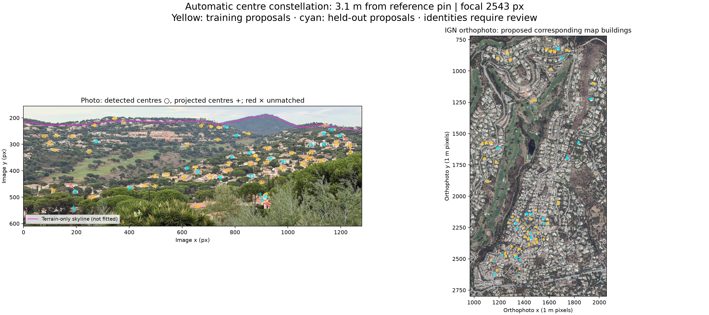
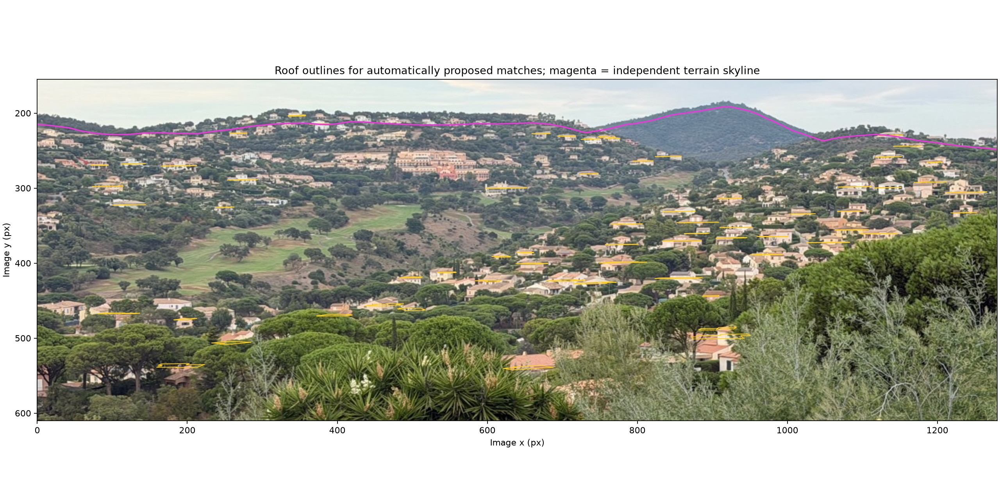
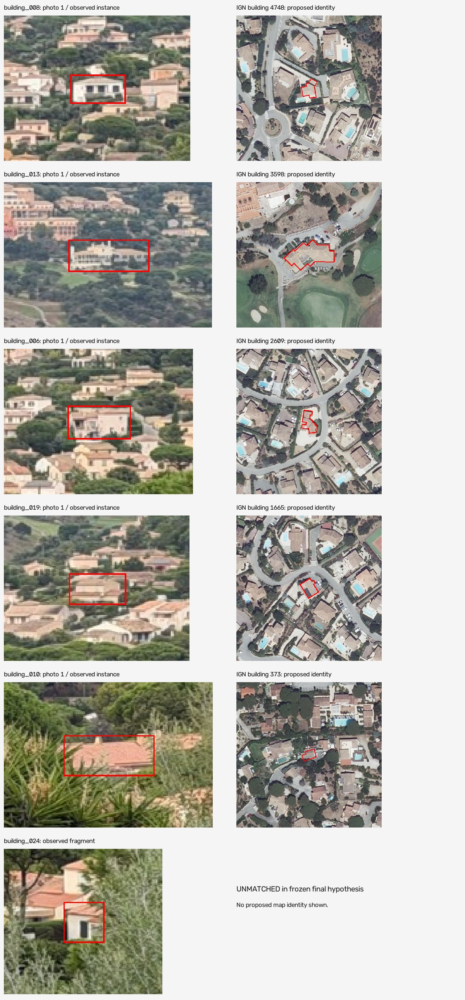

> **Provenance.** Copied verbatim from `reports/geolocation/sainte_maxime_constellation_success_2026-09-24/REPORT.md` (written by a Codex session, 2026-09-24; uncommitted on branch `lens-undistort-pipeline`). Figure and result links were re-pointed to `docs/constellation_geolocation_method_assets/`. The `../../../tools/...` and `../../../benchmarks/...` links refer to files that exist only on that branch; copies of the four method scripts are in `geolocation/chamaa_constellation/original_sainte_maxime/`. The Chamaa test of this method is in `geolocation/chamaa_constellation/results/README.md`.

# Successful visual geolocation through building constellations

## Sainte-Maxime, France — research milestone

**Report date:** 24 September 2026  
**Status:** Successful location recovery on one development scene  
**Method:** Automatic building-centre association with joint camera-position and focal-length search

## Executive summary

We recovered the camera position of a personal iPhone photograph near Sainte-Maxime by matching the spatial arrangement of detected buildings to georeferenced roof centres. The selected result was **3.15 metres from the user-supplied reference pin**.

The successful search used **no hand-picked image-to-map correspondences, no appearance embeddings, and no reference-pin coordinates as solver inputs**. It used a known approximate scene area, a northward-view prior, official IGN building geometry, and a terrain-based camera-height constraint. Predictions and the primary model choice were frozen before calculating their distances from the pin.

This is an important positive result: a semantic building constellation can recover a useful camera location even when individual cross-view feature matches and manually selected corners are unreliable. Jointly estimating focal length was decisive in the tested comparison. Holding the earlier focal estimate fixed missed the pin by approximately 157 m; allowing focal length to vary reduced that discrepancy to approximately 3 m.

**Scope of the success:** the method succeeded on this scene. The 3.15 m figure is a discrepancy from a supplied map pin, not a surveyed accuracy guarantee or an established performance specification. The pin was already known in the conversation, so this is a development experiment rather than a genuinely blind benchmark.



*Circles mark detected image centres; crosses mark their proposed projected map centres. Yellow indicates training proposals, cyan reserved proposals, and red crosses unmatched detections. The corresponding IGN roof polygons appear in the orthophoto. These are proposed identities, not a claim that every match is correct.*

## 1. The problem and the turning point

The input was a set of seven personal photographs looking across the Sainte-Maxime golf valley. The successful location solve used the metadata-free, **1280 × 960** version of photo 1. The wider image set had previously supported scene identification and experimental focal estimation.

Earlier corner-based camera resection failed. Its estimates were 300–418 m from the pin; one produced only 2.16 pixels of fitting error while placing the camera 411 m away. The selected points were clustered around distant structures, and some confused roof, balcony, facade and terrace boundaries. Small image residuals did not establish correct geometry.

The user identified two useful corrections:

1. **Discard uncertain corners.** If using a building corner with DTM elevation, identify an actual, visible wall-ground contact—not an ambiguous point within a facade or a roof vertex arbitrarily lowered to terrain.
2. **Use the entire building constellation and search intrinsics jointly.** Detect houses in the photograph, compare their centres with map roof centres, and search camera position and focal length together rather than trusting the earlier calibration.

The second suggestion produced the successful result. The first prevented further use of unjustified precision controls: no additional ground-contact point passed the visibility, identity and terrain-semantics checks, so none was forced into the solver.

## 2. Data and division of work

| Component | Input or role |
|---|---|
| Photograph | Metadata-free photo 1, 1280 × 960 pixels |
| Image building detections | Cached SAM masks; 69 instances retained after filtering |
| Map building geometry | 2,159 retained IGN 3D roof polygons, from 4,816 downloaded building features |
| Orthophoto | Georeferenced IGN imagery for correspondence inspection |
| Camera elevation prior | IGN RGE ALTI, sampled every 50 m and interpolated; camera at terrain + 2 m |
| Independent mountain check | Approximately 30 m SRTM terrain, not used to fit this camera |
| Reference location | User-supplied pin, used only by the post-fit evaluation script |

The main orthophoto has 1 m output pixels. Additional close-up reference crops use 0.25 m output sampling; neither number is a guarantee of underlying positional or native image accuracy.

**Learned component:** SAM supplies semantic instance masks.  
**Scripted component:** filtering, centre extraction, projection, unknown-correspondence matching, optimization, scoring and error calculation. Random seeds are fixed.  
**AI-assisted review:** identifying which visible corners are defensible and inspecting proposed building identities after fitting. This review does not supply correspondences to the successful search.

Original image attachments were no longer available locally. The surviving stripped copies contain no camera-intrinsics EXIF. Thus the successful run did not use original focal-length metadata or photo GPS. An allowlist-only metadata inspector was prepared for future reuploads.

## 3. The successful pipeline

### Extract spatially distributed image instances

SAM detections were filtered by confidence, area, width, image-edge truncation and centre proximity. The remaining **69 instances** cover multiple parts of the scene rather than one distant complex. Image measurements are mask centroids; bounding-box widths provide a loose size cue.

A fixed split reserves 21 instances for checking and uses 48 for fitting.

### Build the map constellation

Each retained IGN roof polygon supplies a metric planimetric centre, roof elevation and approximate horizontal extent. Tiny or unsuitable objects are filtered out. These roof centres are not assumed to have known image identities.

The successful model uses literal roof centres. An alternative adds a shared downward height correction to approximate the centre of a visible facade; that extra parameter was not necessary for the primary result.

### Search position, orientation and focal length together

The estimated state contains camera east/north position, yaw, pitch, roll and focal length. Camera elevation is constrained by terrain. The camera model assumes equal x/y focal lengths, centred principal point `(640,480)`, and zero residual distortion.

The geometric convention is:

```text
X_camera = R × (X_world − C)
u = f × X_camera.x / X_camera.z + 640
v = f × X_camera.y / X_camera.z + 480
```

World coordinates are Lambert-93 east/north and elevation. Camera axes are right/down/forward. Only positive-depth, plausible-size projections are considered.

A coarse nearest-neighbour point-set score proposes camera hypotheses. Refinement then uses **one-to-one assignment with explicit unmatched options**, combining centre agreement and a loose projected-width check. This prevents multiple image instances from freely claiming the same mapped building and allows uncertain detections to remain unmatched.

All three model variants exchange discovered starting candidates before refinement. This matters: an apparent improvement can otherwise arise because one optimizer found a better local minimum, rather than because its extra model parameter was useful.

### Reserve evidence and evaluate after selection

Pose optimization uses training detections only. Map identities consumed by training assignments cannot be reused by the reserved detections. The literal-roof-centre joint-focal model was designated primary before evaluating distance to the pin.

This is an **unknown-correspondence geometric camera search**, not ordinary PnP with known point identities, not a descriptor embedding matcher, and not a prior-free worldwide location search.

## 4. Measured results

| Configuration | Focal length | Distance from pin | Training assignments | Reserved assignments |
|---|---:|---:|---:|---:|
| Fixed focal length | 2084 px | 156.52 m | 42/48 | 16/21 |
| **Joint focal length + pose** | **2543 px** | **3.15 m** | **44/48** | **21/21** |
| Joint focal + pose + centre-height correction | 2548 px | 8.28 m | 44/48 | 21/21 |

**Primary estimated position:** 43.3171253, 6.6452690  
**Supplied reference pin:** 43.3170973, 6.6452751

The primary model assigns 65 of 69 detections overall, leaving four unmatched. These assignment counts are not measured correspondence precision: some proposed identities remain uncertain.

The focal-length result also has a useful, separate consistency check. An earlier photo-1/photo-2 overlap pair estimated approximately 2561 pixels, close to the constellation estimate. Other overlap pairs disagreed substantially. The evidence supports revisiting the earlier pooled 2084-pixel estimate; it does not establish a complete lens calibration.

## 5. Checks that support the result

### Terrain silhouette, not fitted

After the camera was frozen, the terrain horizon was rendered without optimizing it against the photograph. The prominent peak projects near **(921, 191.5)** pixels, compared with the visually reviewed crest region **x=899–924, y=182–191**.

This supports the broad mountain shape and bearing. Vegetation, DEM resolution and vertical-datum differences prevent treating the crest as a precise surveyed correspondence.



*Yellow: projected roof outlines for proposed identities. Magenta: independent terrain-only horizon. Tree canopies and buildings need not coincide exactly with a terrain-only curve.*

### Building-by-building review



Independent visual inspection of nominated examples found:

- **Clubhouse:** strongly plausible correspondence, supported by its irregular low roof and relationship to the golf complex.
- **Distinct eastern white villa:** plausible correspondence, supported by its massing and neighboring arrangement.
- **Asymmetric eastern house:** plausible, but not independently certain.
- **Generic or foliage-covered roofs:** unresolved identities; not counted as confirmed matches.
- **Small exposed building fragment:** unmatched in the final result, an appropriate abstention.

The inspected examples were not randomly sampled, so they cannot establish overall matching precision.

### Wrong candidates and controls remain visible

The retained secondary joint-model hypothesis is **182 m** from the pin, with reserved cost **3.84**, compared with **1.18** for the primary result. The centre-height model retains another candidate **244 m** away. These wrong alternatives demonstrate that local search failures have not disappeared.

At the frozen primary pose, 100 x-coordinate-shuffled controls produce a median reserved cost of **5.47**, with minimum **3.73**. These controls were not globally reoptimized; they are descriptive evidence, not a search-adjusted significance test or false-positive rate.

Ten synthetic regression tests pass, covering rotation and projection conventions, height offsets, positive depth, one-to-one assignments, unmatched observations and reserved-map identity exclusion. They check implementation correctness, not real-world accuracy by themselves.

## 6. Computation

| Measured stage | Fixed focal | Joint focal | Joint focal + offset |
|---|---:|---:|---:|
| Global search | 14.7 s | 24.7 s | 34.1 s |
| Cross-seeded refinement | 25.8 s | 32.9 s | 43.0 s |

Total recorded script runtime across the three variants is approximately **175 seconds**. Some global runs overlapped, so this is not end-to-end elapsed time. The approximately 58 s joint-model subtotal benefits from discoveries made by the other variants and is not a standalone runtime claim.

These figures exclude cached SAM inference, reference acquisition, human/AI inspection and report production. Association and camera fitting ran on local CPU; no paid GPU compute was launched for those stages.

## 7. What we learned—and what remains unproven

**Supported by this experiment:**

1. Spatially distributed building instances can carry enough geometry to recover this camera location without manually identifying each building first.
2. Fixing an uncertain focal estimate can substantially bias position. Joint focal/position search succeeded in the tested comparison.
3. A visually distinctive constellation can be useful even when ground-contact corners are hidden and direct cross-view feature matching is unreliable.
4. An unfitted terrain silhouette provides valuable corroboration after building-based estimation.
5. Good reprojection error or many matches alone are insufficient; the earlier corner experiment demonstrated that clearly.

**Not established:** general 3 m accuracy, reliable automatic acceptance thresholds, complete building-identification precision, or success with plain 2D OSM footprints and no roof heights.

The search had substantive priors: a **2.5 × 3.5 km** scene-area rectangle, approximately northward view, bounded orientation, focal range **1300–3500 px**, and terrain + 2 m camera elevation. Mask centres change with occlusion and facade visibility. There is no explicit tree/building occlusion model. Reserved detections share the same photograph; they are not independent scenes.

The reference pin was withheld from the solver, but had already been disclosed in the conversation. This success should therefore be preserved as a development milestone and followed by a genuinely blind test, not promoted into a benchmark-wide guarantee.

## 8. Preserved evidence and reproduction

This report directory contains copies of the principal figures and result records so future experiments do not overwrite this evidence. **All three copied refined-result files were checked against the previously frozen SHA-256 hashes and matched at report creation.**

| Saved record | Purpose |
|---|---|
| [Evaluation](constellation_geolocation_method_assets/results/evaluation.json) | Exact metrics, retained alternatives and skyline check |
| [Frozen prediction manifest](constellation_geolocation_method_assets/results/frozen_predictions.json) | Primary-model policy and prediction hashes |
| [Primary refined result](constellation_geolocation_method_assets/results/joint/refined.json) | Parameters, detections, assignments and reserved checks |
| [Fixed-focal result](constellation_geolocation_method_assets/results/fixed/refined.json) | Controlled comparison |
| [Height-correction result](constellation_geolocation_method_assets/results/joint_offset/refined.json) | Additional-model comparison |
| `results/*/results.json` | Earlier global-search candidates and timings |
| `assets/` | Preserved visual evidence |

Implementation and original data remain in the repository:

- [Global constellation search](../../../tools/geolocation/joint_building_constellation.py)
- [Cross-seeded refinement](../../../tools/geolocation/refine_building_constellations.py)
- [Post-fit evaluation and visualization](../../../tools/geolocation/review_joint_constellation.py)
- [Geometry regression tests](../../../tools/geolocation/test_joint_constellation.py)
- [Original working experiment report](../../../benchmarks/france_phone_geolocation/joint_constellation/REPORT.md)
- [Ground-contact review](../../../benchmarks/france_phone_geolocation/ground_contact_review/ground_contact_review.md)
- [Final instance-identity review](../../../benchmarks/france_phone_geolocation/ground_contact_review/final_instance_pair_review.md)

The saved figures and result records are an evidence snapshot, not a complete standalone execution environment. Reproduction also requires the referenced photo, SAM detections, IGN building/terrain caches and Python dependencies. The working scripts write to their fixed benchmark output paths; preserve or copy those outputs before rerunning.

## 9. Recommended next experiment

Freeze the current detector filtering, search ranges, association model and selection policy. Test another civilian scene with its pin withheld until after prediction selection. Include success and abstention cases, retain alternative hypotheses, and measure end-to-end cost including detection and reference preparation.

For these photographs, original-resolution reuploads would enable an independent metadata-based focal check and a renewed review of genuine wall-ground contacts. A held-out view with additional visible buildings would provide stronger evidence than repeatedly fitting the same scene.

## Conclusion

**We succeeded in recovering this supplied location through an automatic building constellation and joint focal/pose search.** The valuable result is not only the approximately 3 m agreement: it is the demonstrated transition from ambiguous, tightly clustered corner controls to broad, unknown-correspondence geometry, with uncertainty, wrong alternatives and independent terrain evidence preserved alongside the success.
