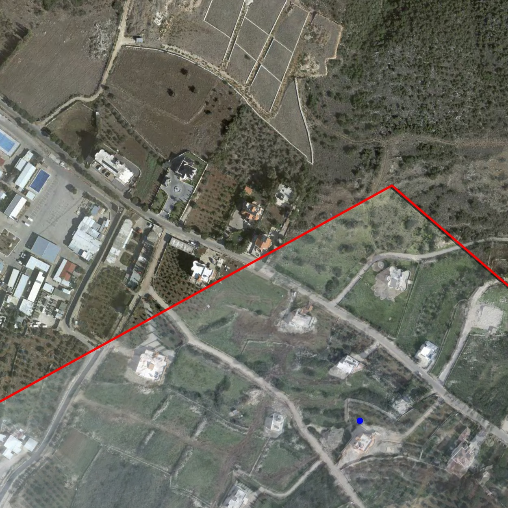

# Aerial photo to orthophoto geolocation

Date: 2026-09-23

## Result

The photo is positively matched inside the supplied search area.

- Supplied coordinate, interpreted as UTM 36N with a truncated northing:
  **705674 E, 3669964 N** (`EPSG:32636`), or **33.14894373 N,
  35.20519626 E**.
- Estimated centre of photo 1: **705529 E, 3670050 N**, or
  **33.14974464 N, 35.20365926 E**.
- The supplied coordinate appears at approximately pixel **(81, 503)** in
  photo 1. It is not the image centre.
- A conservative uncertainty for the image-centre location is **about 10 m**.
  The three learned matchers agree within about 1.3 m, but that agreement does
  not include orthophoto georeferencing error, relief, roof-height parallax, or
  model bias.

The northing `669964` cannot be literal UTM 36N for this orthophoto: it maps
near 6 degrees north. Prefixing the locally omitted `3` gives the southern
Lebanon location covered by the supplied raster.

## Search, not just overlay

A 1 km by 1 km orthophoto crop at 0.4 m/pixel was divided into four 500 m
quadrants. LoFTR tested each quadrant at rotations 0, 90, 180, and 270 degrees.

The winning hypothesis was the northwest quadrant rotated 180 degrees:

| Candidate | Confident matches | Homography inliers | Inlier ratio |
|---|---:|---:|---:|
| winning tile, 180 degrees | 387 | 225 | 0.581 |
| best wrong tile/orientation | 89 | 10 | 0.112 |

The complete 16-candidate leaderboard is in
`loftr_tile_rotation_sweep.json`. This separation is the main retrieval
evidence; the attractive overlay was not used as the sole acceptance test.

## Matcher comparison on the winning tile

All methods were judged with the same robust homography fit. Runtime is for one
pair on this Apple Silicon machine; model download is excluded. LoFTR and
LightGlue ran on CPU. RoMa inference ran on MPS; its one-time model load took
about 35.4 seconds in addition to the listed inference time.

| Approach | Proposed / used | Inliers | Ratio | Centre UTM (E, N) | Runtime | Outcome |
|---|---:|---:|---:|---|---:|---|
| SIFT baseline | 362 | 18 | 0.050 | wrong hypothesis | 0.37 s | abstain |
| SuperPoint + LightGlue | 681 | 231 | 0.339 | 705529.9, 3670050.0 | 9.24 s | success |
| LoFTR | 718 / 420 above confidence 0.3 | 179 | 0.426 | 705528.0, 3670049.8 | 13.31 s | success |
| RoMa | 5,000 sampled | 3,341 | 0.668 | 705528.3, 3670049.4 | 15.48 s | success |

The LoFTR fit has a median inlier reprojection residual of about **1.1 m** and
a 90th percentile of about **1.7 m** in orthophoto coordinates. These are
internal fit residuals, not surveyed absolute errors.

Photo 2 independently fits the same tile and orientation with 118 inliers. Its
image centre maps to 705551 E, 3670018 N; the difference is expected because
the second attachment has different cropping/framing. It is a useful repeat
observation, but not an independent scene.

## Roof and road geometry

The visual geometry check marks six repeatable roofs and three road traces.
The strongest landmarks are:

1. the lobed white villa and its circular tank;
2. the small blue/white rectangular roof northwest of it in the aerial view;
3. four neighboring detached roofs with distinct footprints;
4. the long paved road crossing the foreground;
5. the upper paved road; and
6. the curved connector between the roads.

After the fitted projective transform, all six roof centres land on their
counterpart roofs and the three road traces follow the corresponding map roads.
This is stronger evidence than roof appearance alone: the season and color are
very different, while the roof constellation, junction order, and road curves
are stable.

The direct blend makes the seasonal difference and alignment visible:

## What this does and does not establish

This run establishes **local 2D geolocation within the supplied 1 km prior**.
It is not a blind country-scale search, and it is not a full 6-DoF camera pose.
The projective model is adequate over the matched central/lower ground region,
but extrapolating the four image corners is unsafe because the scene has relief
and tall buildings.

Blind PnP is a separate next experiment. It needs camera intrinsics plus metric
3D map points (DEM/building heights or a reconstructed scene). A single
uncalibrated image and a flat orthophoto do not make camera altitude and full
pose observable.

## Artifacts

- `photo1.png`, `photo2.png`: supplied images.
- `orthophoto_1km_040mpp.png`: local-only source crop, north-up UTM 36N.
- `query_geolocation_points.jpg`: supplied UTM point and matched image centre.
- `roof_road_geometry_check.jpg`: roof-centroid and road-layout inspection.
- `loftr_inliers.jpg`: robust inlier correspondence visualization.
- `alignment_overlay.jpg`: query warped over the orthophoto.
- `loftr_tile_rotation_sweep.json`: all retrieval candidates.
- `results.json`: machine-readable summary and homography.

