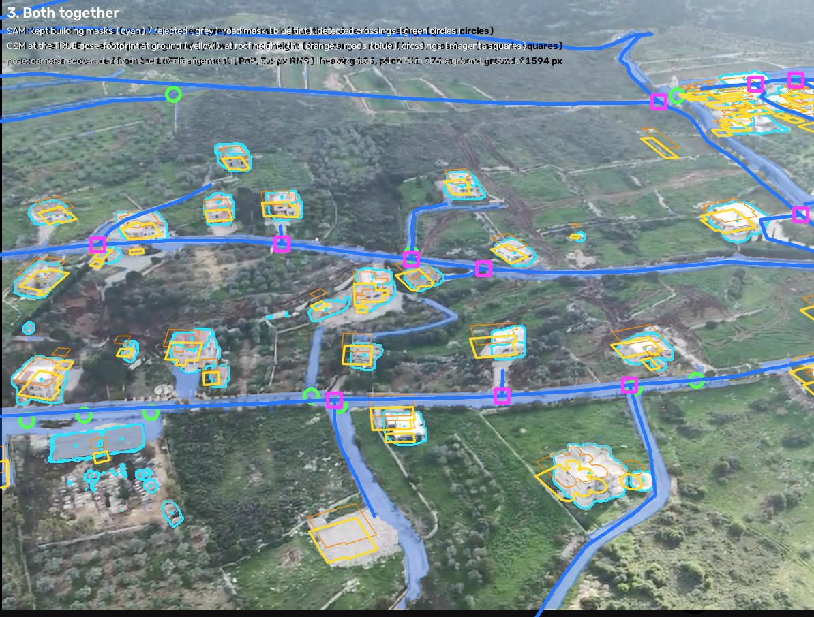
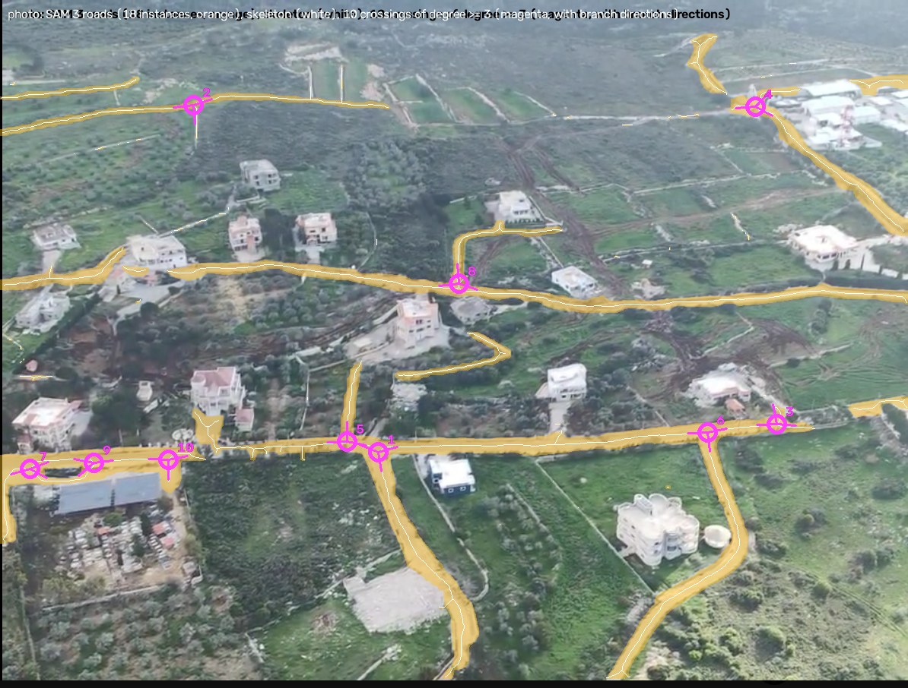
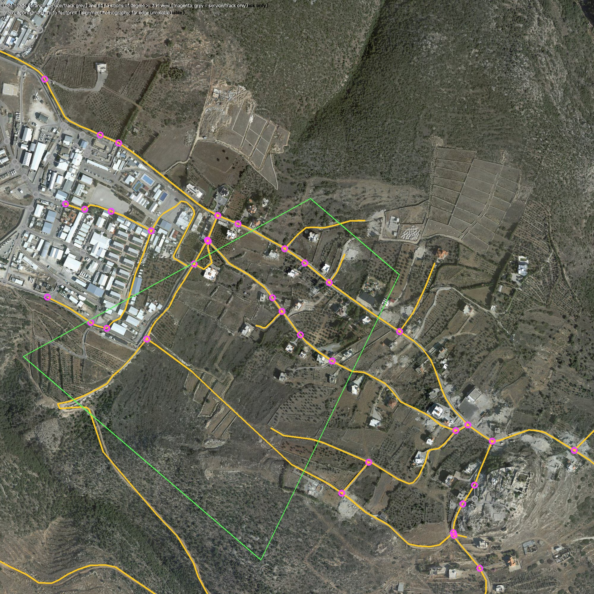
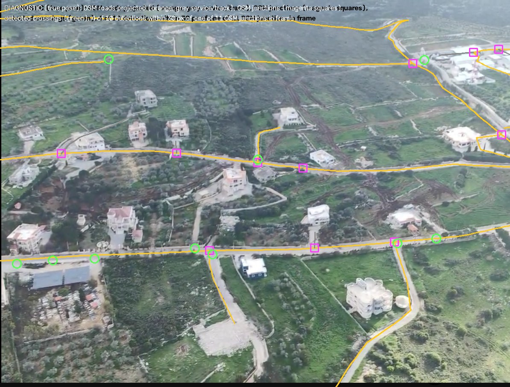
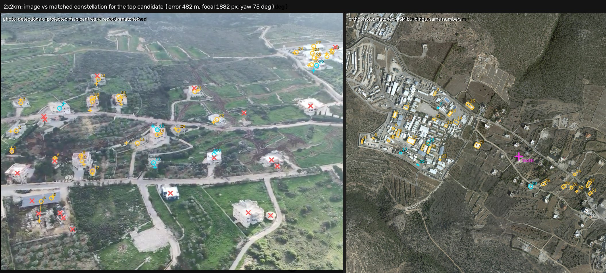
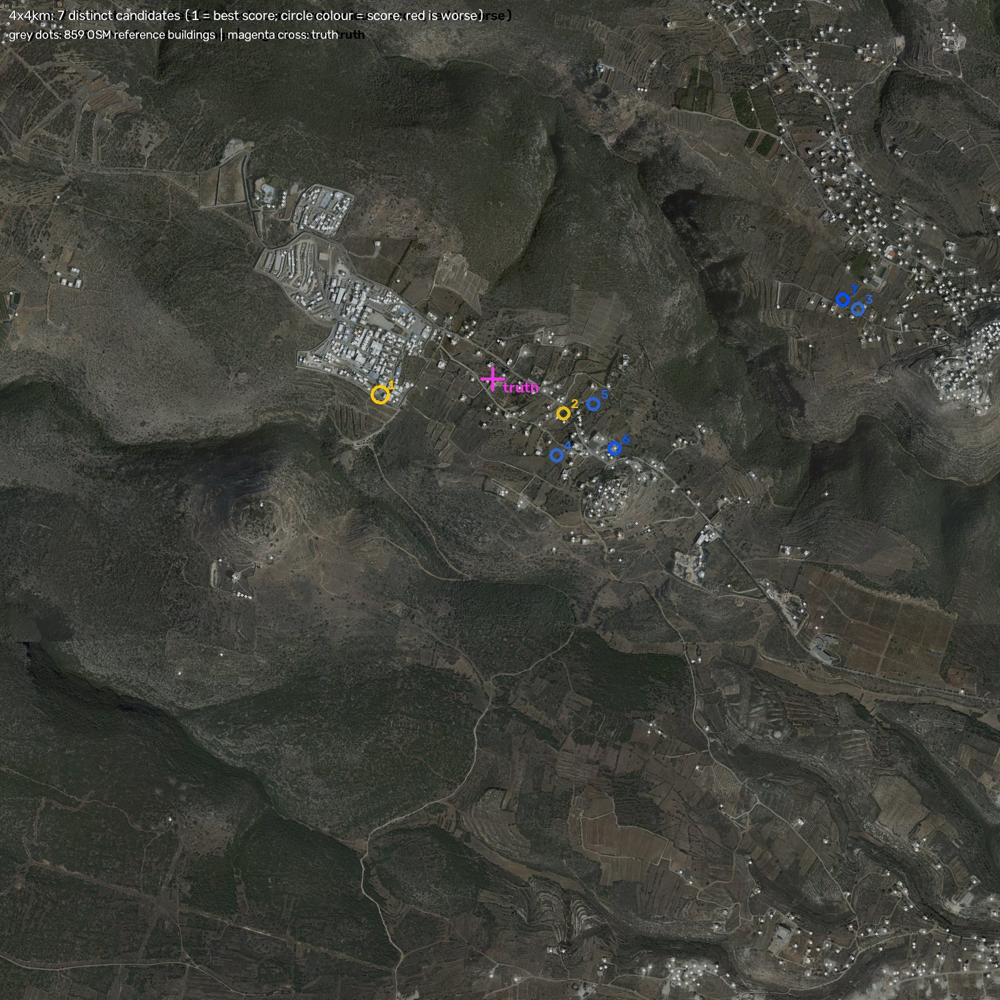
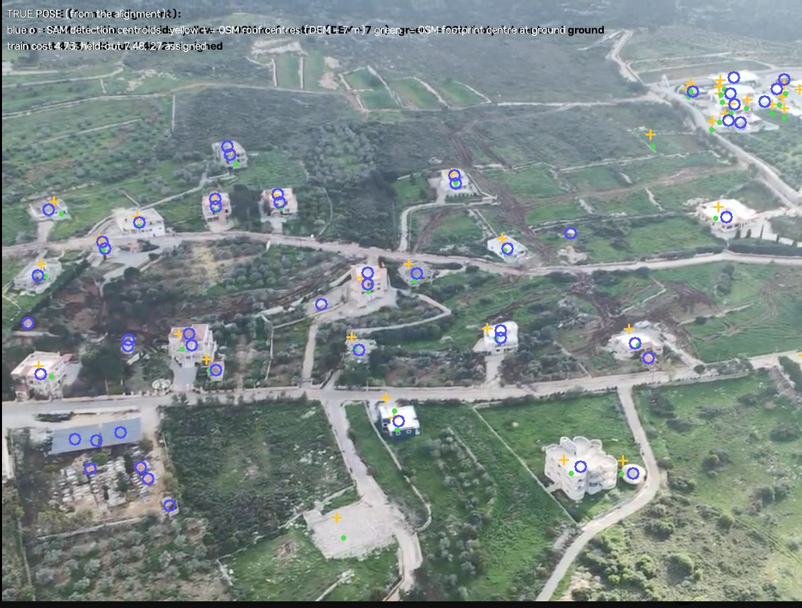

# Building-constellation geolocation on the Chamaa aerial photo

**Test date:** 25 September 2026
**Method under test:** the Sainte-Maxime building-constellation camera search
([write-up](../../../docs/constellation_geolocation_method.md))
**Update — a fully blind search now finds the photo (rank 1, 5 m error).** The original
Sainte-Maxime method, reproduced as written, failed (below). A redesigned search — a grid over
camera tilt/roll/focal, an exhaustive heading × height × position scan in bird's-eye view, then
full 3D refinement scored by chance-corrected significance — ranks the true location first in the
2 × 2 km box with a wide margin. See [Blind decomposed search](#blind-decomposed-search-the-one-that-works).

**Verdict on the original method: it did not succeed.** In both search areas every candidate was
at least 300 m from the truth, and none was within the 50 m "correct" threshold.
Diagnostics show the reason is the **objective function**, not the search budget:
the method's cost scores the *true* camera pose **worse** than a wrong pose 480 m
away. Confining the search to the Chamaa village does not fix it (421 m off).
**A houses + roads objective prefers the truth, but blind search cannot find it** (a
needle-sized basin; see [Bimodal search](#bimodal-search-houses--roads--crossings)).
**Roads look like the missing signal:** projected OSM roads agree with the photo's road
mask 3–5× better at the true pose than at any wrong winner (road F1 0.62 vs 0.12–0.20),
tested on fixed poses rather than yet as a search.

## Blind decomposed search: the one that works

The earlier sections show two separate problems: the original cost scores the truth
worse than wrong poses (a **model** problem), and the houses + crossings significance score
fixes that but blind optimisation cannot find its narrow basin (a **search** problem). This
search fixes the second problem by not running an optimiser over all 7 parameters at once.

**Pipeline (the truth is read only to compute the final error column):**

1. **Camera grid.** Pitch −15° to −75° in 6° steps × roll −6°, 0°, +6° × 6 focal lengths
   (450 × 1.44^k, i.e. 450–2,800 px) = 198 combinations. A feasibility sweep using the truth showed
   the scan tolerates about −6/+8° of pitch, ±6° of roll and ±20% of focal length, which set these steps.
2. **Bird's-eye view.** For each combination, the photo's house detections (51) and road crossings (10)
   are projected onto a flat ground plane at unit camera height.
3. **Height from house size.** The median OSM footprint length (16.5 m) and each detection's pixel
   width give a camera-height estimate. The scan covers 0.6–1.7× that estimate.
4. **Exhaustive scan.** Heading in 3° steps × height in 6% steps × every map position, computed
   with shifted raster sums over OSM house centres and OSM crossings. Each layer's score is
   z = (hits − expected) / √(expected + 1), where the expected count comes from the local map
   density in a 200 m window, so dense areas get no free credit. z_houses + z_crossings are summed and
   the top 3 peaks per combination (≥150 m apart) are kept.
5. **Verify.** The 8 best peaks overall are refined in the full 3D camera model
   (`fair_compare.refine`) and re-scored with the exact significance S from
   [the section above](#why-wrong-poses-beat-the-truth-and-a-score-that-fixes-it).

**Result (2 × 2 km box, 316 OSM buildings, 20.6 min on a laptop CPU plus about 1 min to verify):**

| final rank | grid rank | S | houses matched (chance) | crossings | heading | height m | focal px | error m |
|---:|---:|---:|---:|---:|---:|---:|---:|---:|
| **1** | 1 | **17.8** | 30 (6.9) | 4 | 220 | 279 | 1540 | **5** |
| 2 | 2 | 4.4 | 6 (2.6) | 2 | 306 | 98 | 439 | 437 |
| 3 | 3 | 4.1 | 13 (7.8) | 3 | 115 | 110 | 531 | 647 |
| 4 | 8 | 2.8 | 9 (6.7) | 2 | 331 | 164 | 865 | 142 |
| 5 | 5 | 2.0 | 6 (1.8) | 0 | 140 | 105 | 453 | 1429 |

True pose: heading 223°, height 274 m, focal 1594 px, pitch −30.6°. **Rank of the correct location: 1.**
The grid stage alone also ranks it first, but narrowly (z 10.98 vs 10.57). After verification the
margin is decisive: S 17.8 vs 4.4, i.e. the winner's match count has a chance probability of about
10⁻¹⁸, against about 10⁻⁴ for the runner-up. The refined winner's S equals that of the refined true
pose (17.8), so the search reached the same basin.

**Caveats.** This is one photo in one 2 × 2 km box. The 4 × 4 km box has not been run yet (about 4×
the scan cost, and more chance peaks). The grid stage's small margin shows the coarse z-score is
only a proposal generator; the 3D verification is what decides. Low, steep, wide-angle poses at
the grid's edges (pitch −75°, focal 450) produce most of the false peaks.

Code: `feasibility_bev_search.py` (BEV projection, rasters, scan), `feasibility_sensitivity.py`
and `feasibility_size_prior.py` (tolerance and height-prior studies, which use the truth),
`blind_grid_search.py` (blind grid), `verify_top.py` (3D refinement + S). Outputs:
`blind_grid_search.json/.log`, `blind_grid_verified.json`, `diagnostics/feasibility_*.json`,
`figures/feasibility_bev_heatmap.jpg`.

## Summary (original Sainte-Maxime method)

| | 2 × 2 km | 4 × 4 km |
|---|---:|---:|
| Search box offset from truth (box centre − truth, E/N) | −477 m / −427 m | +29 m / −485 m |
| Truth distance to nearest box edge | 523 m | 1,515 m |
| Reference buildings (OSM, in box) | 316 | 859 |
| Image building detections (SAM 3, after filtering) | 51 | 51 |
| Distinct candidates returned | 3 | 7 |
| **Top candidate's error** | **482 m** | **455 m** |
| Closest candidate at any rank | 326 m (rank 3) | 314 m (rank 2) |
| **Rank of the correct location (≤ 50 m)** | **not found** | **not found** |
| Rank of any candidate within 100 m | not found | not found |
| Score margin, 2nd best − best (training cost, lower is better) | 1.285 | 0.169 |
| Best candidate's held-out cost | 7.26 | 7.32 |
| Shuffled-control held-out cost (median of 100) | 7.20 | 7.40 |
| Runtime (search, excluding one-off SAM and OSM) | 23.9 s | 32.0 s |
| Objective evaluations | 81,011 | 81,014 |

The held-out rows are the telling ones. The winning poses explain the reserved
buildings **no better than randomly shuffled detections do** (7.26 vs 7.20; 7.32
vs 7.40). At Sainte-Maxime the held-out cost was 1.18 against a shuffled median
of 5.47. There, the fit carried real information; here it does not.

### How confidence changes with area

There was no real confidence to lose. With a wrong winner and held-out costs
equal to the shuffled null in both boxes, the margins measure competition between
wrong answers rather than certainty about a right one. The trend is still clear,
though: going from 2 × 2 to 4 × 4 km, the number of distinct candidates rose from
3 to 7 and the winner's margin collapsed from 1.29 to 0.17, as the extra 543 map
buildings supplied more look-alike fits. A larger box gives the method more ways
to be wrong with equal conviction.

## Top candidates (primary model, `joint`)

Score = training assignment cost (the method's selection criterion; lower is better).
Inlier buildings = detections given a map identity by the overall one-to-one
assignment. Latitude/longitude are the **estimated footprint centre** (where the
image-centre ray meets the ground), which is what the ground truth describes.

**2 × 2 km** (only 3 distinct candidates: the 14 refined hypotheses collapsed onto 3 locations)

| Rank | Lat | Lon | Score | Held-out | Inlier buildings | Error | Heading |
|---:|---:|---:|---:|---:|---:|---:|---:|
| 1 | 33.150050 | 35.198497 | 4.227 | 7.262 | 31 | 482 m | 75° |
| 2 | 33.151080 | 35.197942 | 5.512 | 8.055 | 25 | 553 m | 69° |
| 3 | 33.151500 | 35.200853 | 5.870 | 7.782 | 20 | 326 m | 260° |

**4 × 4 km**

| Rank | Lat | Lon | Score | Held-out | Inlier buildings | Error | Heading |
|---:|---:|---:|---:|---:|---:|---:|---:|
| 1 | 33.149264 | 35.198804 | 4.425 | 7.317 | 27 | 455 m | 73° |
| 2 | 33.148446 | 35.206646 | 4.594 | 7.437 | 29 | 314 m | 260° |
| 3 | 33.151983 | 35.219341 | 5.698 | 7.740 | 21 | 1,485 m | 60° |
| 4 | 33.146948 | 35.206292 | 5.708 | 6.954 | 26 | 396 m | 267° |
| 5 | 33.148752 | 35.207930 | 5.753 | 7.270 | 24 | 414 m | 251° |

**Truth:** 33.149742 N, 35.203649 E (UTM 36N 705527.8 E, 3670049.5 N); the true heading is 223°.

### Secondary: the write-up's facade-height variant (`joint_offset`)

The write-up ran three model variants. `fixed` needs a prior focal-length estimate,
which this photo does not have. `joint_offset` adds a shared downward correction
α × building height, meant to move each roof centre toward the centre of the
visible building. **I ran it after seeing the primary fail**, so treat it as
exploratory. It also failed:

| | 2 × 2 km | 4 × 4 km |
|---|---:|---:|
| Top candidate's error | 466 m | 509 m |
| Closest candidate at any rank | 414 m | 460 m |
| Rank of correct / within 100 m | not found / not found | not found / not found |
| Margin | 0.322 | 0.239 |
| Held-out cost vs shuffled median | 7.31 vs 7.39 | 7.81 vs 7.26 |
| Runtime | 28.3 s | 42.2 s |

Full top-5 tables are in `2x2km/joint_offset/evaluation.json` and
`4x4km/joint_offset/evaluation.json`.

## Why it failed: search or model?

A failed search could mean the optimiser never reached the right place, or that
the cost does not prefer the right place even when it gets there. They call for
opposite fixes, so I tested both directly. These two diagnostics **use the ground
truth and are not part of the blind result.**

| Pose evaluated | Footprint error | Training cost | Held-out cost | Inlier buildings |
|---|---:|---:|---:|---:|
| **True camera pose**, recovered from the alignment | ≈ 0 m | **4.73** | 7.48 | 27 |
| True pose + best facade correction (α = 0.40) | ≈ 0 m | 4.47 | 7.30 | 28 |
| Best pose with footprint held within 60 m of truth, orientation free | 13 m | 4.15 | 7.16 | 27 |
| **Blind winner, 2 × 2 km** | 482 m | **4.23** | 7.26 | 31 |

The true pose came from the alignment itself. The homography maps a grid of 117
photo pixels to ground points (z from the DEM), and a PnP solve recovers the
camera (3.6 px RMS): focal 1,594 px, heading 223°, pitch −30.6°, 274 m above
the viewed ground. My reparametrisation reproduces that camera to within 2 m.

**At the true pose the cost is higher than at the wrong winner.** This is a model
failure. More iterations, more seeds or a heading prior could not fix it, because
the optimiser already prefers the wrong answer. (All six global runs did hit the
240-iteration cap without converging, but that is not what decided the outcome.)
The within-60 m oracle recovered the right orientation (heading 227°, pitch
−30.7°), which confirms that the search can find the right basin. It just does
not score it best.

Three mechanisms, all visible in the figures:

1. **A density attractor — where the winner lands, but not why it fails** (see the
   [village sanity check](#sanity-check-search-only-the-chamaa-village): removing the dense
   complex does not help). The blind winner maps the photo's scattered villas
   onto buildings inside a dense fenced compound north-west of the truth
   ([figure](figures/2x2km_image_vs_constellation.jpg)). With dozens of buildings
   packed together, a map point falls within tolerance of almost any detection. The
   cost checks that each detection is near some map point; it has no term for how
   dense the map is locally, and none for whether the spacing between matched
   buildings agrees. The compound is genuinely in the photo, at the top-right
   edge; the winner spreads it across the whole frame. All four blind winners (two
   areas × two model variants) look east, at headings 73–76°, against a true 223°.
   This is the same density trap the earlier quad-hashing constellation attempt on
   this photo hit (2.1 km off): raw agreement favours the densest place.
2. **Parallax between mask centroids and roof centres.** At the true pose the
   projected OSM roof centres land on the correct houses, but consistently
   10–20 px above-left of the SAM mask centroids (median 13 px;
   [figure](figures/diagnostic_true_pose_projection.jpg)). From 274 m up at −31°,
   a mask covers roof *plus* visible facade, so its centroid sits between roof and
   base. The cost's tolerance is σ = max(4 px, 0.16 × width), about 5–8 px here,
   so every correct pair pays 2–3σ. At Sainte-Maxime the houses were small and
   distant from a ground-level camera, and this offset was negligible. The facade
   correction removes only part of it (4.73 → 4.47).
3. **Unmatched clutter — smaller than first estimated.** The
   [sanity overlay](#sanity-overlay-do-sam-and-osm-agree-on-this-photo) counts only 5 of 51
   kept detections with no OSM building (a blue-roofed shed, a stone yard) and 2 of 47 OSM
   buildings with no mask (one is now a cleared lot); my first estimate of ~8 and ~5 was
   too high. Each unmatched detection still costs the maximum 9, but this is a minor factor.

Of the three, the second — the height/centroid offset — is the root cause, with the third a
minor contributor: they make the true pose fit
poorly (4.73), so some wrong location always scores as well or better. The compound
merely supplies one such location, and removing it moves the winner elsewhere.

The missing heading prior is **not** the cause. It makes the search space about
6.5× larger than Sainte-Maxime's, but the true pose already loses on cost.

## Is the camera assumed to be at ground level?

*Added 25 Sep 2026 on request.* **The original script does; this port does not.** Sainte-Maxime
fixes the camera at terrain + 2 m (`original_sainte_maxime/joint_building_constellation.py`,
line 65), because it was a phone photo taken on the ground. The Chamaa port searches the camera
height, 40–1,200 m above the viewed ground, with pitch −80° to −12° (`chamaa_constellation.py`,
`LOG_HEIGHT`, `BOUNDS_ANGLES`). Every hypothesis it produced was airborne (119–540 m), the true
pose is 274 m, and the parametrisation reproduces the true camera to within 2 m.

One ground-level assumption did survive, in the scoring: each SAM detection is treated as the
building's **roof centre**. From a ground-level view of distant houses that is close enough; from
274 m at −31° a mask covers roof and facade. Three checks at the true pose (diagnostics that use
the truth):

| Check | Result |
|---|---|
| Replace "roof centre" with the centre of the building's projected 3D silhouette | median offset 17.1 → 15.1 px. **Height is not the main problem.** |
| Direction of the offsets | a consistent ~9 px sideways shift in every part of the image (left, right, near, far); removing it leaves 10.9 px scatter per building |
| Same test on roads | best shift only 4 px, overlap 0.53 → 0.55: **the pose is right**; the offset is specific to building positions |

So the camera geometry is correct, and so is the height handling. The real mismatch is that OSM
building footprints sit a few metres off relative to the roads and imagery (≈ 3 m at this range),
with ~11 px of per-building scatter on top. The method's tolerance, 16% of a building's width
(5–8 px here), was set for survey-grade IGN roofs.

**Does a realistic tolerance fix it?** Training cost with the original σ combined with a
map-accuracy term of σ<sub>m</sub> metres projected to pixels:

| Pose | Error | σ<sub>m</sub> = 0 (original) | 2 m | 3 m | 4 m | 6 m |
|---|---:|---:|---:|---:|---:|---:|
| True pose | 0 m | 4.68 | 4.21 | 3.92 | 3.70 | 3.42 |
| Blind winner 2 × 2 km | 482 m | **4.21** | **3.92** | **3.70** | **3.49** | **3.19** |
| Blind winner 4 × 4 km | 455 m | 4.43 | 4.27 | 4.24 | 4.17 | 4.01 |
| Blind winner, village | 421 m | 4.50 | 4.27 | 4.17 | 4.04 | 3.85 |
| Blind winner, village minus complex | 517 m | 4.92 | 4.81 | 4.75 | 4.65 | 4.25 |

It helps: from 2 m on, the true pose beats three of the four wrong winners. But the strongest
wrong candidate still wins at every tolerance. With a realistic tolerance, houses alone are still
not distinctive enough here, while roads separate the truth from every winner 3–5×. The next step is
a bimodal search (houses with a metre-based tolerance, plus road-line agreement and crossings).

## Bimodal search: houses + roads + crossings

*Added 25 Sep 2026 on request.* `bimodal.py` keeps the camera model, search boxes and protocol,
and replaces the objective. Everything was fixed before any run, and the search reads only the
box bounds:

J = house cost / 9 + 1.0 × (1 − road F1) + 0.3 × (1 − crossing match), lower is better.

* **Houses:** the original one-to-one assignment, with the tolerance widened by 4 m of map error
  (typical OSM accuracy) projected to pixels at each building's distance.
* **Roads:** F1 between projected OSM road centrelines (DEM-lifted, every 4 m) and the photo's SAM
  road mask, at an 8 px tolerance.
* **Crossings:** the share of detected crossings with an OSM crossing within 30 px, weighted lower
  because as points they match only ~40%.

At the true pose J = **1.01**; at the old house-only winner J = 1.53. So the objective now prefers
the truth. The blind searches still missed it:

| Area | Search | Winner J | Winner error | Closest candidate | Road F1 | Crossings | Heading | Runtime |
|---|---|---:|---:|---:|---:|---:|---:|---:|
| 2x2km | bimodal | 1.307 | 480 m | 223 m | 0.35 | 5/10 | 76° | 181 s |
| 2x2km | bimodal, heading-stratified | 1.244 | 640 m | 206 m | 0.33 | 7/10 | 164° | 406 s |
| 4x4km | bimodal | 1.220 | 368 m | 368 m | 0.33 | 8/10 | 99° | 227 s |
| village | bimodal | 1.292 | 436 m | 259 m | 0.37 | 7/10 | 86° | 169 s |

(True pose: J 1.01, road F1 0.59, 4/10 crossings, heading 223°.) **Every winner scores worse than the
truth**, so this is now a *search* failure, not a model failure. The winners also match more
crossings than the truth does (up to 8 of 10), because poses that put many OSM crossings in frame can
game that term.

**Why the search misses it: the good basin is a needle.** Perturbing one parameter at a time from the
true pose (`coarse` score; truth 1.27, best DE ever found 1.45):

| Offset from the truth | Score | vs. best found |
|---|---:|---|
| 10 m position | 1.72 | already worse |
| ±2° heading | 1.41–1.44 | edge of the basin |
| ±1° roll | 1.38 | edge |
| ±2° pitch | 1.90–1.94 | outside |
| ±5% focal | 1.60–1.62 | outside |
| ±10% height | 1.85–1.96 | outside |

The score only rewards a pose once roads and houses align within ~8 px, about 2.5 m at this range,
and it is flat outside that. Even with DE confined to the correct 45° heading sector, it reached only
1.68 against the truth's 1.27.

**Coarse-to-fine does not rescue it** (`bimodal_c2f.py`, checked at fixed poses before running): soft
scores with tolerance τ.

| τ | Truth | Best wrong winner | Prefers | Funnel |
|---:|---:|---:|---|---|
| 60 px | 0.868 | 0.945 | **truth** | ~15 m, ±5° |
| 120 px | 0.614 | 0.564 | wrong | wider |
| 250 px | 0.331 | 0.273 | wrong | wider |
| 400 px | 0.207 | 0.171 | wrong | ~200 m |

No tolerance both funnels and discriminates: loose enough to create a slope from hundreds of metres
away, the score already prefers wrong basins. A blind optimiser over the 7-parameter camera has no
path to the truth here, so the coarse-to-fine search was not run.

**Conclusion.** Houses + roads + crossings *identify* the right answer; blind global optimisation
cannot *find* it. The search has to be driven by correspondences instead: propose camera poses from
small sets of matched features (e.g. pairs of crossings with their branch directions), which land
directly in the needle-sized basin, then rank the proposals with this objective (the RANSAC pattern,
and what collapsed the search in the simulation's object-grouping step).

## Crossings only, and houses + crossings (no road lines)

*Added 25 Sep 2026 on request* (`diagnose_crossings_only.py`). Crossings are scored by **F1**:
one-to-one matches within 30 px between the 10 detected crossings and the OSM crossings projected
into the frame; precision = matched ÷ OSM crossings in frame, recall = matched ÷ detected. Unlike
the earlier recall-only term, a pose cannot win by filling the frame with OSM crossings.
A = 1 − crossing F1; B = house cost / 9 + (1 − crossing F1). Lower is better.

**At fixed poses, crossings prefer the truth:**

| Pose | Error | Crossing F1 | Matched / in frame | A | B |
|---|---:|---:|---:|---:|---:|
| True pose (uses the truth) | 0 m | **0.38** | 4 / 11 | **0.619** | **1.032** |
| Winner 2 × 2 km, house-only | 482 m | 0.05 | 1 / 33 | 0.953 | 1.345 |
| Winner 2 × 2 km, bimodal | 480 m | 0.14 | 5 / 59 | 0.855 | 1.359 |
| Winner 2 × 2 km, stratified | 640 m | 0.20 | 7 / 61 | 0.803 | 1.291 |
| Winner 4 × 4 km, bimodal | 368 m | 0.16 | 6 / 64 | 0.838 | 1.344 |
| Winner village, bimodal | 436 m | 0.17 | 7 / 71 | 0.827 | 1.410 |

None of 3,000 random poses reaches the truth's score on either objective.

**But blind search finds wrong poses that beat the truth** (2 × 2 km, same DE protocol):

| Objective | Runs finding a wrong pose scoring better than the truth | Error of those poses |
|---|---:|---:|
| A: crossings only | 1 of 3 (0.579 vs 0.619) | 912 m |
| B: houses + crossings | 2 of 3 (0.955 and 1.015 vs 1.032) | ~570 m |

The crossings-only winner matches 4 of 9 crossings in frame, as good as the truth, at a spot 912 m
away. With 10 detected crossings, 6 of them wrong, the crossing evidence is **ambiguous**: other
places match as well as the right one. The crossing score is also *easy* to search — DE reaches good
values quickly — so this is a genuine property of the objective, not a search failure.

**Conclusion.** Crossings are the right tool for **proposing** poses (cheap; a correct pairing lands in
the right basin) but not for **judging** them. The road lines are what make the right answer stand
out. Caveat: for the full houses + roads + crossings objective, no search has yet found a wrong pose
that beats the truth, but the searches there were too weak to be sure none exists. The proposed
method is unchanged: crossing pairs generate candidate poses; the full objective with roads ranks them.

## Why wrong poses "beat the truth", and a score that fixes it

*Added 25 Sep 2026 in response to review questions.* Three questions: it cannot make sense for a
wrong pose to beat the ground truth; are more features penalised or rewarded; and can the score
be simpler and less narrow?

**1. Part of it was an unfair comparison** (`fair_compare.py`). The wrong poses had been optimised
for the score; the true pose had not (it is a fixed estimate from the alignment). With every pose
given the same local refinement:

| Objective | True pose | Best wrong pose | Verdict |
|---|---:|---:|---|
| Crossings only (1 − F1) | 0.579 | **0.500** (920 m off) | wrong still wins: genuinely ambiguous |
| Houses + crossings | 0.960 | 0.953 (570 m off) | a tie — the "beat" was mostly unfairness |
| Houses + roads + crossings | **0.937** | 1.266 | truth wins clearly |

Figures: [overview of footprints](figures/fair_compare/overview_footprints.jpg), and per pose the
photo with every layer projected beside the photo orthorectified onto the map:
[truth](figures/fair_compare/pose_0.jpg), [houses + crossings, 570 m](figures/fair_compare/pose_3.jpg), and
[the others](figures/fair_compare/). Nearly every wrong pose puts the footprint on the dense compound.

**2. The other part: the house score rewarded chance.** The inherited house term charges only for
*detected* houses left unmatched; OSM buildings projected into the frame with nothing there cost
nothing. The 570 m pose floods the frame with ~150 projected compound buildings, so every
detection finds one by chance: its house score (3.17) beats the truth's (3.63), and only road F1
(0.12 vs 0.65) exposes it. Scoring houses symmetrically (F1: matched ÷ detected and matched ÷ in
frame) stops the flooding, but blind search then found a different loophole: a **zoomed-in, low
pose** (focal 2,447 px, 93 m up) where the tolerance circles become so large that "38 of 38"
houses match along 50–120 px lines ([figure](figures/fair_compare/houses_f1_wrong.jpg)). Houses-F1
and houses + crossings-F1 were beaten this way in 3 of 3 blind runs each (`symmetric_houses.py`).

**3. A chance-corrected score** (`significance.py`). What matters is not how many features match but
how many would match *by chance* for that pose. q = fraction of the image covered by the tolerance
discs of the map features projected into the frame; k = one-to-one matches; n = detections. Under
chance each detection lands in the covered area with probability q, so the significance is
S = −log₁₀ P(Binomial(n, q) ≥ k). It rewards more matches and automatically penalises dense map
areas, loose tolerances and zoomed-in poses. Layers add. **Houses + crossings only — no roads:**

| Pose (all refined identically) | Error | Houses matched (by chance) | Crossings | Total S |
|---|---:|---:|---:|---:|
| **True pose** | 7 m | 30 / 51 (6.9) | 4 / 10 | **17.8** |
| Earlier house-cost winner | 443 m | 37 (14.2) | 5 | 13.2 |
| Houses + crossings winners | ~570 m | 41 (29.5–32.2) | 4–5 | 7.4–7.6 |
| Zoomed "38 of 38" pose | 604 m | 32 (**22.2**) | 3 | 5.4 |
| Crossings-only winners | 380–912 m | 7–26 | 3–4 | 5.6–6.2 |
| **Blind search on S, 3 runs** | 457–868 m | 15–23 (4.5–6.3) | 4–8 | 8.2–12.2 |

The truth is the most significant pose of every one found, fixed or blind; no blind run beats it
(12.2 vs 17.8). The zoomed pose matched 32 houses where 22 were expected — no evidence — while
the truth matched 30 where 7 were expected. **This is the first score here that judges correctly
without roads.** It does not *find* the truth: blind search still ends 457–868 m away, because the
basin is still narrow. That is the job for correspondence-driven proposals.

**Simpler, convex, or gradient-descent-friendly?** No formulation with unknown correspondences is
convex: which map feature each detection belongs to is combinatorial, and perspective projection is
non-linear. The measured trade-off is fundamental: tolerances wide enough to create a slope from
hundreds of metres away already prefer wrong basins (τ ≥ 120 px above). Gradient descent works well
once correspondences are fixed — then pose fitting is a small, well-behaved least-squares problem
(PnP). So: propose poses from matched feature pairs, refine each by gradient descent, and judge the
results with S.

**Partial roads.** Roads are only partly visible (at the true pose 41% of projected OSM road length is
not on the SAM road mask) and still separated the truth from every wrong pose. But the chance-corrected
house + crossing score does that without roads, which avoids relying on visible road coverage.

## Sanity overlay: do SAM and OSM agree on this photo?

*Added 25 Sep 2026 on request.* Before trusting any score built on SAM and OSM, check that
the two sources actually describe the same scene. `sanity_overlay.py` draws both on the photo
at the true pose (camera recovered from the LoFTR alignment; a diagnostic that uses the truth).



*Cyan: SAM building masks the method kept (grey: rejected by its filter). Blue tint: SAM road
mask. Green circles: detected crossings. Yellow: OSM footprints projected at ground level; thin
orange: the same at roof height (DEM + 7 m or `building:levels` × 3 m). Blue lines: OSM roads.
Magenta squares: OSM crossings.* Separate panels: [SAM only / OSM only / both](figures/sanity_overlay_panels.jpg).

| | Overlaps the other source |
|---|---:|
| OSM buildings projecting into the photo | **45 of 47 (96%)** overlap a SAM building mask |
| SAM building masks kept by the method | **46 of 51 (90%)** overlap a projected OSM building |

(Overlap is any shared pixel with the building's full projected silhouette, ground to roof.
That answers "same building?", not "same point?".)

**The sources fit.** Nearly every house appears in both, and the OSM roads land on the photo's
roads. The overlay also shows the house score's real problem directly: each OSM footprint at
ground level sits in the lower part of its SAM mask, and at roof height near the top, while the
SAM centroid falls between them — the 10–20 px offset that a 5–8 px tolerance punishes.
Mismatches are few: a blue-roofed shed and a stone yard SAM finds but OSM lacks, an OSM
footprint on what is now a cleared lot, and a few footprints shifted a few metres sideways
from their masks.

## Sanity check: search only the Chamaa village

*Added 25 Sep 2026 on request.* The question: with the search confined to the village,
does the method find the right place?

"The village" was defined from the map, not from the truth: OSM's place node for
شمع (Shama, 33.14631 N, 35.20731 E) plus the connected cluster of OSM buildings chained
within 80 m of each other around it, a 1.57 × 1.09 km box (`data/village_definition.json`).
Two findings shaped the test:

* The village's **core** (buildings chained within 60 m) is 569 × 587 m, and the photo
  footprint lies **just outside it to the west**. The photo shows Chamaa's western outskirts,
  so a tight "village" box would exclude the answer.
* Loosening to 80 m takes in the outskirts **and merges with the dense complex** that
  captured the wide search. OSM tags the complex's 179 buildings only as `building=yes`,
  so it cannot be excluded by tag. A map-only density rule does isolate its packed core
  (groups of ≥ 50 buildings chained within 30 m: 168 buildings), though it misses the
  complex's outer ring.

| Village search | Reference buildings | Top error | Closest candidate | Correct found? | Held-out vs shuffled |
|---|---:|---:|---:|---|---:|
| A: village as mapped | 306 | 421 m | 299 m | no | 7.36 vs 7.48 |
| B: village minus the dense complex | 214 | 517 m | 455 m | no | 7.97 vs 7.88 |

**No: even confined to the village, the method does not find the photo.** Removing the
dense complex made it slightly worse; the winner moved to a different wrong place (heading
275°). This corrects the emphasis above: the complex is where the wide-area winner landed,
not the reason the method fails. The reason is that the house cost fits the true pose poorly.

## Road crossings, and roads as a second modality

*Added 25 Sep 2026 on request:* road crossings as a second anchor type alongside houses.

**Detection.** Image side (`road_junctions.py`): SAM 3 road instances (the original
segmentation script's road prompts, threshold 0.3; 18 instances) are unioned, closed 9 × 9
(SAM fragments roads at trees, so a crossing otherwise shows as two facing ends),
skeletonised, and crossings of degree ≥ 3 extracted: **10 found**. Map side: OSM highway
ways (footways, paths and steps excluded), where ≥ 3 road segments meet: **174 in the
4 × 4 km box**, 44 of them involving only service roads or tracks.

| | |
|---|---|
|  |  |

**Checked against the true pose (a diagnostic that uses the truth):**


* **Road geometry aligns within a few pixels.** Roads lie on the ground, so they have none
  of the height parallax that displaced the house centroids by 10–20 px.
* **Crossings as points agree only partly:** 4 of 10 detections are within 30 px of one of
  the 11 OSM crossings in frame (precision 0.40, recall 0.36). The misses have clear causes.
  OSM maps driveway junctions too narrow for SAM to segment. SAM finds real tracks and
  connectors that OSM lacks (top-left track; the northward connector at detection #5). Four
  detections are spurious, where the road mask frays around sheds.

**Does road evidence prefer the truth where houses did not?** (`diagnose_road_score.py`)
Road F1 is the agreement between projected OSM centrelines and the photo's road mask
within 8 px; crossings are one-to-one matches within 30 px.

| Pose | Error | House cost (lower better) | Road F1 (higher better) | Crossings matched |
|---|---:|---:|---:|---:|
| **True pose** (uses the truth) | 0 m | 4.73 | **0.62** | **4 / 11** |
| Blind winner 2 × 2 km | 482 m | 4.23 | 0.16 | 1 / 29 |
| Blind winner 4 × 4 km | 455 m | 4.43 | 0.14 | 0 / 46 |
| Blind winner, village | 421 m | 4.51 | 0.15 | 1 / 28 |
| Blind winner, village minus complex | 517 m | 4.92 | 0.20 | 2 / 59 |
| Blind winner 2 × 2 km, `joint_offset` | 466 m | 4.37 | 0.14 | 0 / 49 |
| Blind winner 4 × 4 km, `joint_offset` | 509 m | 4.20 | 0.12 | 0 / 69 |

The house cost ranks the truth below every wrong winner; road agreement ranks it **3–5×
above all six**. **Caveat:** these are seven poses, not a search. The wrong poses were
chosen by the house cost, never by roads, so a search that optimises road overlap could
still find its own wrong answers, for example by aligning any long straight road with
another. This shows roads carry the discriminating signal the houses lacked. It does not
yet show that a bimodal search will find the truth; that is the next experiment.

## Comparison with Sainte-Maxime

| | Sainte-Maxime (write-up) | Chamaa (this test) |
|---|---|---|
| Outcome | **3.15 m** from the reference pin | **Failed**: ≥ 314 m, correct not found |
| Held-out cost vs shuffled median | 1.18 vs 5.47 | 7.26 vs 7.20 (no better than noise) |
| Camera | Phone, ground level (terrain + 2 m), near-horizontal | Aerial, 274 m up, pitch −31° |
| Heading prior | Yes, yaw −20..35° | None, 0–360° (blind) |
| Search area | 2.5 × 3.5 km rectangle | 2 × 2 km and 4 × 4 km, offset |
| Reference buildings | 2,159 IGN 3D roofs, **with measured roof elevations** | 316 / 859 OSM 2D footprints, height = DEM + 7 m (assumed) |
| Detections | 69 SAM instances (48 train / 21 reserve) | 51 (36 / 15) |
| Blind? | No: the pin was known in the conversation (the write-up says so) | Yes: the truth never enters the search |
| Runtime | ~58 s joint-model subtotal | 24–42 s per area and mode |

The write-up itself flagged two conditions this test hit directly. It listed as
**not established** "success with plain 2D OSM footprints and no roof heights",
and it asked for "a genuinely blind test". This is both, and on this scene the
method did not transfer. The geometry is also very different: a steep oblique
aerial view makes the roof-versus-mask-centroid parallax large, where a
ground-level phone view kept it small.

## What was reproduced, and what had to change

**Unchanged from the original code** (`original_sainte_maxime/joint_building_constellation.py`, `refine_building_constellations.py`):
the rotation and projection conventions; SAM 3 detection with prompts building/house/roof,
threshold 0.3 and mask-IoU dedup 0.72, run with the original script; mask centroids as
observations, with bbox width as the size cue; the near-duplicate rule; the 70/30 train/reserve
split with seed 7; footprint centroids, minAreaRect half-axes and the 45–2,500 m² filter; the
coarse nearest-neighbour cost; the one-to-one assignment with dummy "unmatched" slots, its σ
and its width term; DE with 3 seeds × popsize 16 × 240 iterations; Powell polishing of the
best 12; local DE refinement of the best 2; training-only selection; reserved detections
barred from reusing training map identities; and the 100 x-shuffled controls.

**Changed, because the scene required it** (decided before any evaluation):

1. **Camera height.** The original fixes the camera at terrain + 2 m (a phone on the ground).
   This photo is aerial, so height above the viewed ground is a searched parameter, 40–1,200 m.
2. **Parametrisation.** The search state is the ground point hit by the image-centre ray,
   bounded to the search box, rather than the camera position. The camera is then placed back
   along that ray. This makes "search area" mean where the photo looks, and the estimate
   compares directly with the footprint-centre truth.
3. **Heading.** No prior: yaw is the full 0–360°; pitch −80..−12°, roll ±10°, focal
   400–3,000 px. The original used yaw −20..35° from knowing the view faced north.
4. **Map heights.** IGN supplied roof elevations. Here roof centre = 10 m DEM +
   `building:levels` × 3 m when tagged, otherwise 7 m.
5. **Image filters**, rescaled to this photo from the detection statistics alone: score ≥ 0.35
   (unchanged), mask area 100–9,000 px, bbox width 8–160 px and height < 200 px, 5 px edge
   margin, and the bottom black band excluded. The original used a 180–570 px horizontal band
   suited to a ground-level photo.
6. **Only the `joint` model** as primary (the write-up's designated primary), and `joint_offset`
   as secondary. `fixed` needs a prior focal estimate that does not exist here, and there was
   no cross-seeding between modes.
7. **No terrain-silhouette check.** The photo shows no sky, so there is no skyline to render.

**Reference source.** OSM coverage of this village is unusually good: nearly every house in
the photo has a footprint ([coverage check](figures/diagnostic_osm_coverage_on_photo.jpg); OSM
outlines projected into the photo through the ground-truth alignment, so it is a diagnostic
that never entered the search). So this failure is not explained by missing map data.

## Ground truth and blindness

* The truth is the footprint centre from the earlier LoFTR alignment
  (`data/alignment_results.json`: 225 inliers at 180°, control tile abstained, ~10 m
  conservative uncertainty). `make_truth_and_areas.py` reproduces the alignment's two recorded
  numbers (image centre within 1 m, supplied coordinate exactly) before accepting it.
* The boxes are the truth plus a random offset (seed 20260925), and the offsets are recorded in
  `data/truth.json`. The search reads only `data/search_areas.json`, which holds the box
  bounds. Only `evaluate.py` and the two `diagnose_*.py` scripts read `data/truth.json`.
* "Correct" was defined as ≤ 50 m before results were examined.

## Figures

| | 2 × 2 km | 4 × 4 km |
|---|---|---|
| Area map with all candidates | [area](figures/2x2km_area_candidates.jpg) | [area](figures/4x4km_area_candidates.jpg) |
| Top candidate's matched buildings on the orthophoto | [ortho](figures/2x2km_top_matched_on_ortho.jpg) | [ortho](figures/4x4km_top_matched_on_ortho.jpg) |
| Image beside the matched constellation | [side by side](figures/2x2km_image_vs_constellation.jpg) | [side by side](figures/4x4km_image_vs_constellation.jpg) |
| Same for `joint_offset` | `figures/2x2km_joint_offset_*.jpg` | `figures/4x4km_joint_offset_*.jpg` |

Diagnostics (use the truth): [map points at the true pose vs detections](figures/diagnostic_true_pose_projection.jpg),
[OSM coverage projected into the photo](figures/diagnostic_osm_coverage_on_photo.jpg).







## What would have to change

These are hypotheses, **not tested here**:

* **A density-aware score.** Normalise agreement by local map density (a Poisson-style null
  with a multiple-testing penalty, as this repo's ortho-matching work recommends), so a dense
  compound cannot win by offering a neighbour to everything.
* **Relative-geometry consistency.** Penalise matched sets whose inter-building spacing and
  ordering disagree with the photo. The current cost scores each pair independently.
* **A mask model that fits the view.** Predict where the visible roof-plus-facade centroid falls
  for each building, or widen σ for steep oblique views. The facade correction captured only
  part of the offset.
* **Evaluate on a second, unrelated blind scene** before attributing this to Chamaa alone.

## Reproduce

```bash
cd geolocation/chamaa_constellation
python3 make_truth_and_areas.py            # truth + offset boxes (seeded)
python3 fetch_reference.py                 # OSM buildings for the boxes (cached in data/)
# SAM 3 detections are committed in data/sam_photo1/segments.json. To regenerate them, run the
# original script from the branch where it lives (it imports tools/ortho_matching/extract_scene_geometry.py):
#   python3 tools/geolocation/segment_cross_modal_anchors.py --ground <this dir>/data/chamaa_photo1.png \
#     --ortho <this dir>/data/orthophoto_1km_040mpp.jpg --out-dir <this dir>/data/sam_photo1 --only ground \
#     --semantics building --building-prompts building,house,roof --threshold 0.3 --max-side 1280
python3 test_chamaa_constellation.py       # 10 geometry tests
python3 chamaa_constellation.py --area 2x2km
python3 chamaa_constellation.py --area 4x4km
python3 chamaa_constellation.py --area 2x2km --mode joint_offset
python3 chamaa_constellation.py --area 4x4km --mode joint_offset
python3 evaluate.py && python3 evaluate.py --mode joint_offset
python3 diagnose_oracle.py && python3 diagnose_true_pose.py   # use the truth; not blind
python3 blind_grid_search.py && python3 verify_top.py      # the blind search that works
```

Dependencies: numpy, scipy, opencv, pyproj, rasterio. Regenerating detections needs SAM 3
(`facebook/sam3`) and the original branch's segmentation wrapper; the committed detections make
that optional. Ortho cuts need the
`tzafon_3_26.ecw` layer and the `ecw2tiff` converter (`ortho_io.py`); the DEM is
`height_evoPilot.tif` (10 m, UTM 36N). The last three are local, not in the repository.
